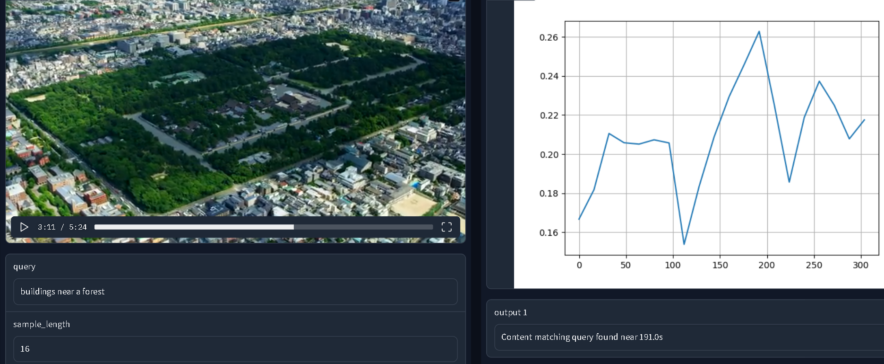
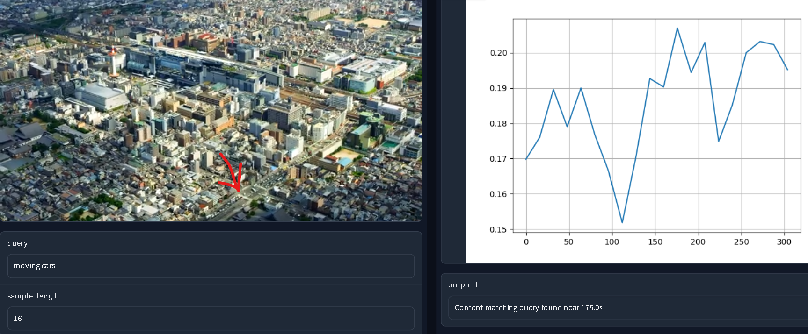
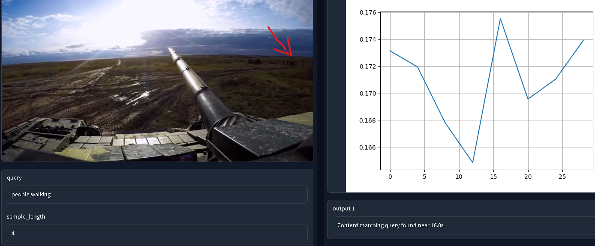

# video_search_demo

Given a text query, the app returns the video timestamp that is most likely to contain the content of interest.  
The graph on the top right shows relative probability of interest plotted against timestamp in seconds.  
The "sample length" option determines how many seconds of video will be examined at a time by the model.  A higher value will allow for faster search but at reduced precision and potentially accuracy.  

  

## Try it 

1. Clone this repo and switch to project directory
1. Install dependencies: `pip install -r requirements.txt`
2. Launch app: `python gradio_app.py`

### Notes

Credits to [Armadas](https://www.youtube.com/watch?v=zCLOJ9j1k2Y) for the aerial video.

Known issue:  random crashes with large video files